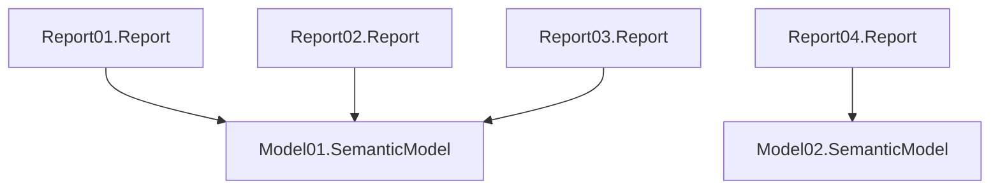

[](https://github.com/RuiRomano/pbip-demo/actions/workflows/deploy.yml)

This repository demonstrates a Power BI Project (PBIP) folder organization with multiple reports and semantic models.



It also demonstrates how to easily deploy reports and semantic models to a Fabric workspace using [Fabric CRUD REST APIs](https://learn.microsoft.com/en-us/rest/api/fabric/articles/item-management/item-management-overview) together with [fabric-cicd](https://microsoft.github.io/fabric-cicd/latest/).

## Instructions

- Fork the repo.
- Configure required [Github secrets and variables](#secrets-and-variables) in your repo if you wish to test deployment from GitHub.
- Run the [deploy](/.github/workflows/deploy.yml) Github workflow to deploy into your tenant.

## Deploy content with script

Make sure you have the [Fabric CICD](https://microsoft.github.io/fabric-cicd/latest/) installed. If not, run:
```bash
$ pip install fabric-cicd 
```

### Secrets and variables

Before running the Github Action, ensure you configure the following [GitHub action secrets and variables](https://docs.github.com/en/actions/security-for-github-actions/security-guides/using-secrets-in-github-actions):

| Name            | Type   | Value                |
|-----------------|--------|----------------------|
| `FABRIC_CLIENT_ID`       | Secret | [Service Principal](https://learn.microsoft.com/en-us/entra/identity-platform/howto-create-service-principal-portal) client ID from your tenant   |
| `FABRIC_CLIENT_SECRET`   | Secret | Service Principal secret |
| `FABRIC_TENANT_ID` | Secret | Your tenant ID |
